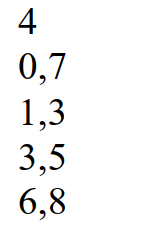
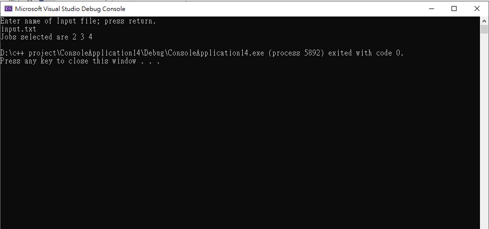

# CS601-Interval-Scheduling-Problem

This program focus on solving the scheduling interval problem using greedy approach.

The algorithms receive a set on n jobs (labeled from 1 to n), and the start time and the finish time for each job. It returns the list of jobs that are mutually compatible and the set should have maximum size.

### Sample input and output:

Input:

output:

Team members: Yi-Nong Wei, Vijayalaxmi Patil
